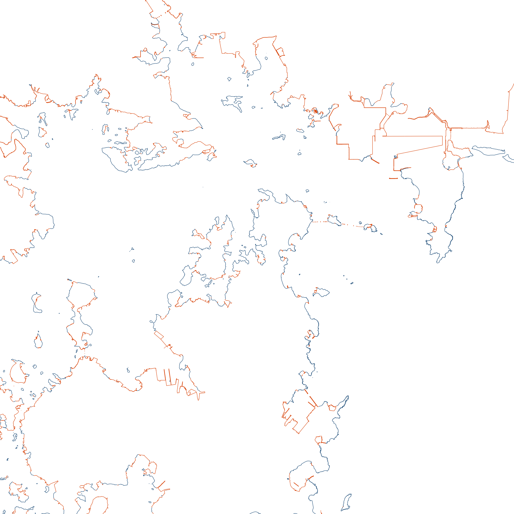
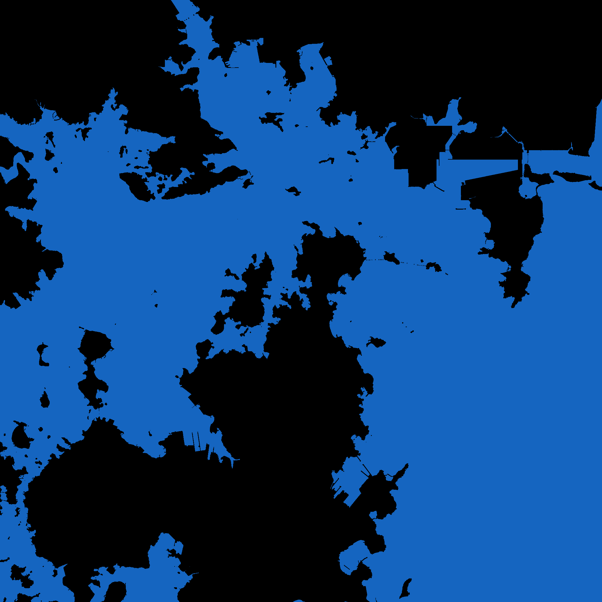
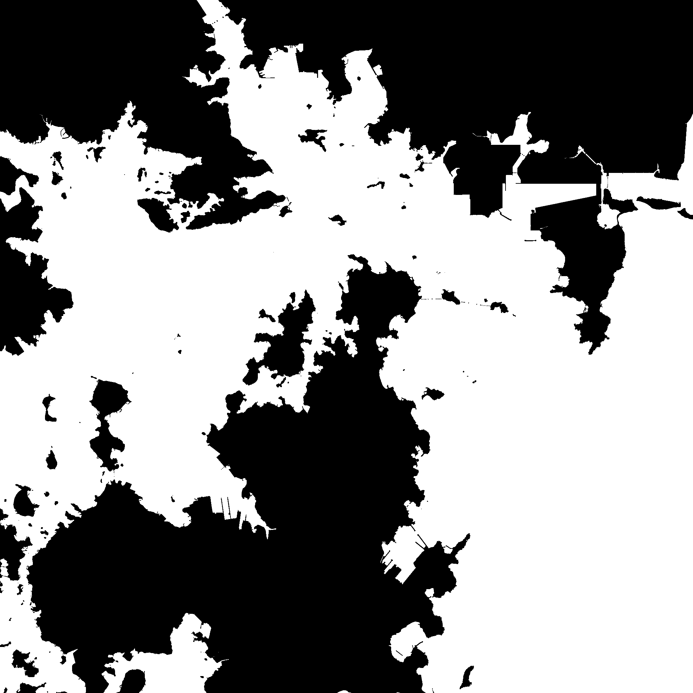

# 장목항 해안선 경계점

전자해도(S-57, EnChartV2 chart.db)에서 추출한 거제도 장목항 주변 육지/바다 경계점(해안선) 데이터입니다.

- 기준점: 장목항 (경도 128.6743314, 위도 34.992829) - EnChart 초기 화면 중심
- 범위: 원(반경 20km / 50km), 직사각형(±20km / ±50km)
- 대상: COALNE(자연 해안선), SLCONS(방파제·부두·호안 등 인공 해안선)
- 좌표계: WGS84 십진수 도
- 포함: 엑셀(.xlsx), CSV, PNG(해안선 / 육지검정·바다파랑 / 육지검정·바다흰색)

## 다운로드
데이터 파일(`장목항_해안선_경계점.Egg`, 약 97MB)은 [Releases](../../releases) 에 있습니다.
.Egg 는 알집(ALZip) 압축 형식입니다.

## 2048px 이미지 (장목항 ±20km)
[`이미지_2048px_20km/`](이미지_2048px_20km) - 축·제목 없이 지도만 담은 2048×2048 PNG (40×40km, 1px ≈ 19.5m)

| 해안선 | 육지검정 / 바다파랑 | 육지검정 / 바다흰색 |
|---|---|---|
|  |  |  |

픽셀 ↔ 경위도 변환식은 `좌표범위.txt` 참고.
